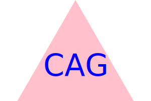

# SVG Image Generator

## Description

SVG image generator is a reliable way for developers to generate logos. The project uses node.js generate and export a SVG image. The application allows the user to select between three shapes, circle, square, and triage for the background. They are then able to input up to 3 characters and select the color of the letters. The application was built from the ground up using test driven development; the test are included in the file for reference. Special attention was given to organization of the folders and the use of Classes when writing the javascript. 

- My motivation for creating this project was to make use of the new node.js skills, practicing TDD, using classes, importing and exporting files using require and the file system in node.js. The project also solves a practical issue of needing to generate logos based on user inputs. 

- I build this project because practice is the best way to learn a new skill and the project was right in line with the new skills I have been learning. I also find SVG images interesting so it was enjoyable to work with them. 

- The application remove tedious and repetitive work required to constantly create logos. 

- From this project I learned how to import and export classes, extend classes, use Inquirer gather user inputs from the command line, create SVG images and write them to a file, deconstruct objects, use Test Driven Development, import and and export files using the file system.

## Usage

Here is a link to a Screencastify video explaining how to use the application.

- https://drive.google.com/file/d/1EY4UlEwu6A_m4LtBvuhLZ-sGEns7v_gi/view

Here is an example of an image generated by the SVG image generator

## Credits
Ross and Addison from EdX, Matt J, MDN, node.js official documentation, W3Schools, ChatGPT

## Tests

Run the test by entering 'npm run test' into the console. The test file is shapes.test.js.